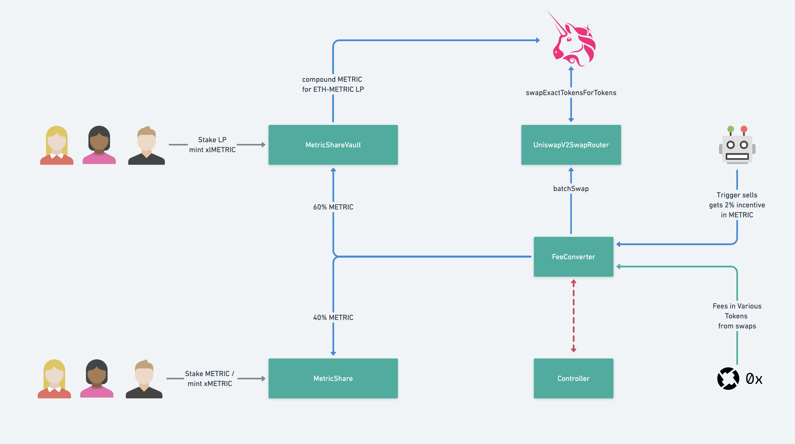

# Metric Exchange Contracts

This repository contains contracts related to Metric's fee collection and distribution logic
The exchange app can be used in [metric.exchange](https://metric.exchange)

Here is a high level view of implemented contracts and their interactions:

## development

The project uses `hardhat` for compiling/testing/deploying purposes. 
See following [tutorial](https://hardhat.org/tutorial/) for a detailed explanation of different concepts and tools

### Environment setup

In order to run different project tasks, start by copying `.env.sample` into a new `.env` file and filling all needed
variable

## deployment

deploy scripts are under [scripts](scripts) folder. Example of deploy command:

`npx hardhat run scripts/ropsten/deployV0.ts --network ropsten`

The project uses hardhat [etherscan-plugin](https://hardhat.org/plugins/nomiclabs-hardhat-etherscan.html) for
verifying contracts

### Ropsten testnet

latest deployed contracts, might change with further development:

- MetricToken : `0xbFe5392d1b804329F77BDa57f4c38Ac6C5aA286F`, with public mint function ;) 
- MetricShare : `0x76b521C7A859ff60823a7a3AA17619010e405a46`
- UniswapV2SwapRouter : `0x0a950cDa0E029F7BF2Af71ebd1316d5bC6c181ec`
- MetricShareVault : `0x9fF0A743b7a4f3d9ed186CC1020b9162C11E0595`
- Controller : `0xbC92c1b320751a7fd020DbE74D762c7407658a74`
- FeeConverter : `0x0E10E94F21210E04ca06C4C7DbD827e5dd68AD3a`
- METRIC-ETH UNI pair: `0x432E7a45a8c2f1699b9B6561e5F1224F8442A603`

### ETH Mainnet

### V1
- MetricToken : `0xefc1c73a3d8728dc4cf2a18ac5705fe93e5914ac`
- MetricShare : `0xdBd974ec753054e78Aa8Eb959761e3d22C632490`
- UniswapV2SwapRouter : `0xC0D469d5fa25Ef2Fdf0bb111e96f1f93f5B4c588`
- MetricShareVault : `0x04d69Aec4eFdb5613120758d6c4cDB970f64a4E5` (not used anymore)
- Controller : `0xc96e4cAa735184E68E53E130cDb59ce13C8EbeC1`
- FeeConverter : `0x88CEEBC001EFc373b7535f61B7EA21330F9D4a85` (not used anymore)
- METRIC-ETH UNI pair: `0xa7d707118c02dCd2beA94Ff05664DB51363c47BD`

### V2
- MetricShareVault : `0xAccbBaad2182FfA54996a480f70b2301cce7F5F7`
- FeeConverter : `0xD11b2EC32f7e9fdfFbf4134b67178E056B58f6c8`